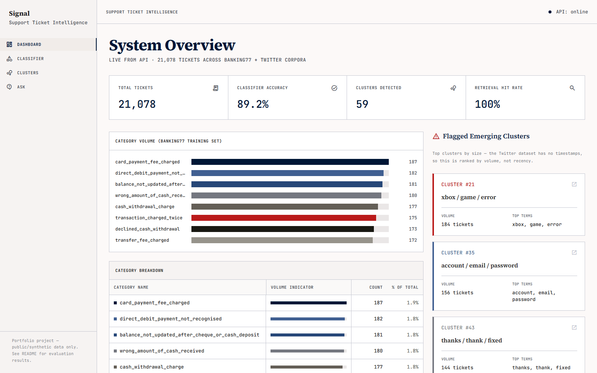
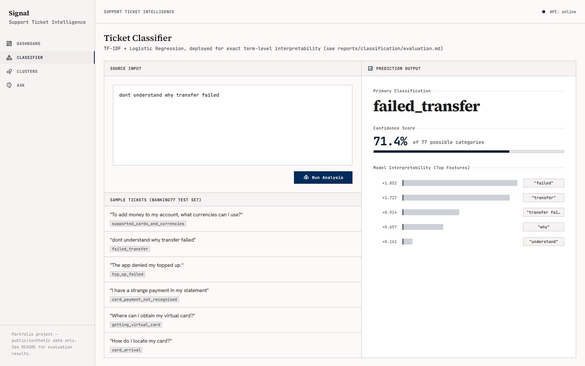
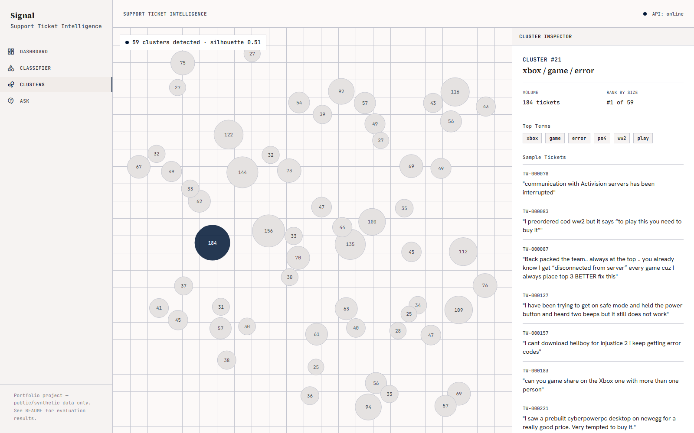
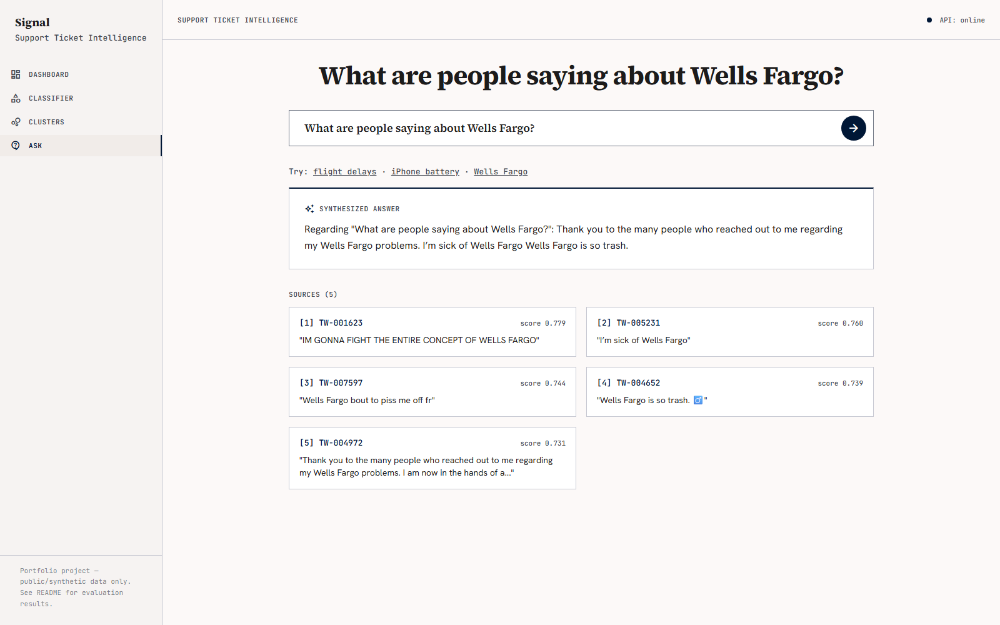

# Signal — Support Ticket Intelligence Platform

> A portfolio project demonstrating full ML-lifecycle competency: experimentation → evaluation →
> deployment → monitoring. Built entirely with free/open-source tools, $0 budget, CPU-only.

**Live demo:** [signal-mmuf.onrender.com/dashboard.html](https://signal-mmuf.onrender.com/dashboard.html)
(free-tier hosting — spins down after ~15min idle, first request after that is a slow cold
start while the container restarts and models reload)

---

## The problem

Support teams generate large volumes of unstructured text that mostly goes unanalyzed:
categorization is inconsistent, emerging issues stay invisible until volume is already high
(there's no label for a bug that hasn't been named yet), and a manager who wants to know "what's
trending in complaints this week" has to wait on someone to read hundreds of tickets by hand.
Signal addresses all three with one pipeline: classify what's already known, cluster what isn't,
and answer plain-English questions over the whole corpus with cited sources. Full problem
statement, users, and scope: `PRD.md`.

## What it does

- **Classifies** incoming tickets into categories, with confidence scores and interpretable
  top-contributing terms (not a black box).
- **Clusters** tickets to surface emerging issues before a human has labeled them.
- **Answers natural-language questions** about the ticket corpus with cited source tickets
  (retrieval-augmented summarization).

## Screenshots

| Dashboard | Ticket Classifier |
|---|---|
|  |  |

| Cluster Explorer | Ask a Question |
|---|---|
|  |  |

---

## Architecture

```
banking77 (labeled, 13k)        Twitter customer-support corpus (unlabeled, 8k, English-only)
        │                                          │
        ▼                                          ▼
 TF-IDF + LogReg classifier          all-MiniLM-L6-v2 embeddings
 (deployed for interpretability;         │                    │
  93.0%-accuracy embedding model         ▼                    ▼
  evaluated but not deployed —    UMAP → HDBSCAN        FAISS index
  see Results below)              (56 clusters)         (query-time retrieval)
        │                              │                      │
        │                              │                      ▼
        │                              │            extractive TF-IDF+MMR
        │                              │            summarization (no neural
        │                              │             model — see Results)
        │                              │                      │
        ▼                              ▼                      ▼
              FastAPI (src/api/) — /health /classify /stats /clusters /clusters/{id} /ask
                     │ loads all models once at startup, rate-limited, Pydantic-validated
                     ▼
       Static frontend (plain HTML/CSS/JS + Tailwind, matches the Stitch design)
       served from the SAME container/origin as the API
                     │
                     ▼
       Docker (non-root, uid 1000) → Render free tier (512MB RAM)
                     │
                     ▼
       Evidently AI drift reports + prediction logging (monitoring/)
```

This is what got *built*, not the original plan — several boxes changed from
`TECHNICAL_ARCHITECTURE.md`'s first draft after hitting real problems (Chroma segfaulting,
`bart-large-cnn` OOM-ing on the free-tier host, HF Spaces requiring a paid plan). Every change is
documented in place in `TECHNICAL_ARCHITECTURE.md` and the relevant `reports/` file, not silently
swapped. See `TECHNICAL_ARCHITECTURE.md` for the full original design and component rationale.

---

## Results

### Classification (Phase 2)

| Model | Accuracy | Macro F1 |
|---|---|---|
| Baseline: TF-IDF + Logistic Regression (**deployed**) | 89.2% | 0.893 |
| Upgrade: MiniLM embeddings + Logistic Regression | 93.0% | 0.930 |

The embedding upgrade is more accurate, but the **TF-IDF baseline is what's deployed** — it gives
exact, per-term interpretability (required by PRD F2 and the Stitch Classifier screen design),
which the embedding model's dense features can't provide without a separate, potentially
misleading approximation layer. Full reasoning, per-class metrics, confusion matrix, and the
business-cost writeup (which error type is optimized against and why) are in
[`reports/classification/evaluation.md`](reports/classification/evaluation.md).

### Clustering (Phase 3)

- **56-59 clusters** found across 8,000 unlabeled Twitter customer-support tickets (HDBSCAN;
  ~54-55% of tickets left as noise, expected for short, topically diverse social text). The exact
  count varies slightly by platform (56 on the Windows dev machine, 59 on the Linux Docker
  build/live deployment) despite a fixed random seed — UMAP's floating-point behavior isn't
  bit-identical across platforms/BLAS backends, a real reproducibility limitation worth stating
  plainly rather than pretending one exact number holds everywhere. The qualitative
  findings below are the durable takeaway; exact cluster IDs shift slightly between runs.
- **Silhouette score: ~0.51** (clustered points only, 10-D UMAP space) — stable across both runs.
- **Human-legibility review** of 5 clusters: 4/5 genuinely coherent and actionable (account
  access, flight delays, gaming platform issues, negative flying sentiment); 1/5 turned out to be
  off-topic social chatter (McDonald's cravings) that isn't a support issue at all — a real
  finding a legibility review catches that an accuracy metric wouldn't. Full review:
  [`reports/clustering/legibility_review.md`](reports/clustering/legibility_review.md).

### Retrieval + Summarization (Phase 4)

- **Retrieval hit rate: 100%** (15/15 hand-built questions had a relevant ticket in the top-5),
  **mean recall@5: 78.7%** — FAISS + all-MiniLM-L6-v2 over the Twitter ticket corpus.
- **Summarization: extractive (TF-IDF + MMR sentence selection), not a neural model.** Three
  models tried, in order: `flan-t5-base` failed on 15/15 test questions (echoed its own prompt
  template); `bart-large-cnn` fixed that and scored well (3.7/5 usefulness) — but its ~1.6GB
  memory footprint OOM'd on Render's free-tier 512MB RAM cap during Phase 7 deployment, and no
  realistic smaller neural model closes that gap. Switched to a scikit-learn-only extractive
  approach: same 3.7/5 mean usefulness, zero hallucination risk (every word traces to a real
  ticket), a few KB of memory instead of 1.6GB. Full history in
  [`reports/retrieval/evaluation.md`](reports/retrieval/evaluation.md).
- **Vector store: FAISS, not Chroma.** Chroma's Rust bindings segfaulted unpredictably on this
  Windows dev environment, reproducible even in minimal cases outside this codebase. Switched to
  FAISS — TECHNICAL_ARCHITECTURE.md §2.2's own named alternative.
- **Manual usefulness rating: 3.7/5 mean** across the 15 test answers — consistently on-topic and
  non-hallucinatory, main weakness is prose fluency (reads as stitched fragments rather than fully
  fluent prose on some questions), an honest tradeoff for a free CPU-only model.

---

## Running locally

```bash
python -m venv .venv
source .venv/Scripts/activate  # Windows Git Bash; use .venv\Scripts\activate on cmd/PowerShell
pip install -r requirements.txt
cp .env.example .env
```

### Docker (single container, matches the deployed setup)

```bash
docker compose up --build
```

Serves both the API and frontend on `http://127.0.0.1:7860` (single exposed port — the
`Dockerfile` was originally built for HF Spaces' single-port requirement; Render, the actual
deployment target after HF Spaces turned out to require a paid plan — see Architecture note above
— also just needs one port, so no changes were needed there). The `Dockerfile` regenerates all
data/model artifacts *inside the image* at build time (ingestion → classifier training →
clustering → retrieval indexing) rather than copying them from the host — they're gitignored, so
this proves the pipeline is genuinely reproducible from source. Runs as a non-root user (uid
1000). torch is installed from the CPU-only wheel index explicitly — otherwise pip pulls the
default CUDA build, contradicting the project's stated no-GPU-dependency constraint. Memory is
tuned to fit Render's free-tier 512MB cap (thread-pool limits, malloc arena limiting, and —
the biggest lever — an extractive rather than neural summarizer; see Results below).

### Frontend

```bash
cd frontend && python -m http.server 5500
```

Then open `http://127.0.0.1:5500/dashboard.html` (API must be running on `http://127.0.0.1:8000` —
override via `window.SIGNAL_API_BASE` in each page if needed). Plain HTML/CSS/JS, no build step —
the same stack the Stitch export itself uses (Tailwind CDN + vanilla JS), per
TECHNICAL_ARCHITECTURE.md §2.4's "whichever stack the export produces" guidance. Four screens:
`dashboard.html`, `classifier.html`, `clusters.html`, `ask.html`, sharing `shared/api.js` (API
client), `shared/nav.js` (sidebar/topbar), and `shared/tailwind-config.js` (design tokens
extracted from `design/stitch-export/archive_intelligence/DESIGN.md`). Verified in a real browser
(Playwright) against the live API — all four screens render, the golden path on each works
(classify a ticket, click a cluster bubble, ask a question), no console errors.

**Honest simplifications vs. the Stitch mockup** (flagged since the mockup numbers looked
plausible but aren't backed by real data): the mockup's Resolution Rate, Avg Sentiment, 30-day
trend deltas, and per-cluster Trend/MTTR tiles have no corresponding field in either source
dataset (no timestamps, no resolution status, no sentiment scores were computed). Rather than
fabricate those numbers, the dashboard shows real computed metrics instead (classifier accuracy,
retrieval hit rate, cluster count/silhouette, category volume) and the "Flagged Emerging
Clusters" panel is explicitly labeled as ranked by volume, not recency. Added one endpoint beyond
TECHNICAL_ARCHITECTURE.md §2.3's original draft contract, `GET /stats`, to serve these.

### API

```bash
uvicorn src.api.main:app --reload
```

Swagger UI at `http://127.0.0.1:8000/docs`. Endpoints (see `TECHNICAL_ARCHITECTURE.md` §2.3 for
the full contract): `GET /health`, `POST /classify`, `GET /clusters`, `GET /clusters/{id}`,
`POST /ask`. All models (classifier, clustering artifacts, retrieval index, summarizer) load once
at startup. `/classify` and `/ask` are rate-limited (20/min, 10/min respectively — `slowapi`, per
`SECURITY_AND_ACCESS.md` §3) and validate input via Pydantic (empty/oversized/malformed requests
return 422). CORS origins configurable via `CORS_ALLOWED_ORIGINS` in `.env`.

### Data

```bash
python -m src.data.ingest_banking77       # labeled: 77-intent banking support queries
python -m src.data.ingest_twitter_support  # unlabeled: real-world customer support tweets
```

Both scripts are idempotent (safe to re-run) and write to `data/processed/` (gitignored — not
committed; regenerate from these scripts). Sources:

- **banking77** (HF Hub `banking77`, PolyAI) — ~13k customer banking queries across 77
  fine-grained intents. Used as the labeled corpus for classification (Phase 2).
- **Twitter Customer Support** (HF Hub
  [`MohammadOthman/mo-customer-support-tweets-945k`](https://huggingface.co/datasets/MohammadOthman/mo-customer-support-tweets-945k))
  — real customer-support tweets, ~945k rows. We use a fixed, seeded random sample of 8,000
  customer-initiated messages (portfolio scale, per `TECHNICAL_ARCHITECTURE.md` §5) as the
  unlabeled corpus for clustering/retrieval (Phases 3-4). Filtered to English-only via
  `langdetect` — an early clustering run (Phase 3) showed non-English tickets collapsing into
  language-identity clusters instead of topical ones, so this is filtered at ingestion.

Both are cleaned via `src/data/cleaning.py`: PII-shaped tokens (emails, phone numbers, URLs,
@handles) are redacted, whitespace is normalized, and exact duplicates are dropped — see
`SECURITY_AND_ACCESS.md` §1. See `notebooks/01_eda.ipynb` for class balance, text length
distribution, and sample tickets.

_Further run instructions (training, API, frontend) added as each phase lands._

### Monitoring

```bash
python -m src.monitoring.generate_drift_report
```

Two Evidently AI drift reports in `monitoring/reports/`: a held-out-split "no shift" baseline
(0/4 features flagged — confirms the monitor doesn't cry wolf) and a genuine domain-shift example
(Twitter corpus vs. banking77 — 4/4 features flagged). Every `/classify` and `/ask` call is
logged to `monitoring/logs/predictions.jsonl` (timestamp, input hash, output — no raw text
stored).

**Automated:** [`.github/workflows/monitoring.yml`](.github/workflows/monitoring.yml) runs this
pipeline weekly (and on manual dispatch) in GitHub Actions, checks the results against
`MONITORING.md` §3's thresholds (`src/monitoring/check_thresholds.py`), opens a GitHub issue if
any are breached, and commits refreshed reports back to the repo. It's a regression check against
freshly re-run source data, not a live-production-traffic monitor — `predictions.jsonl` lives on
the deployed container's ephemeral filesystem and isn't reachable from CI; see `MONITORING.md` §5
for the honest scoping and what closing that gap would take. Full retraining-trigger plan and
cadence: `MONITORING.md`.

---

## Project status

See `CLAUDE.md` for the phase-by-phase checklist.

---

## Resume bullet draft

> Built and deployed **Signal**, an end-to-end ML platform (classification, unsupervised
> clustering, retrieval-augmented Q&A) for support-ticket triage, covering the full ML
> lifecycle from experimentation through production monitoring; shipped a live public demo on a
> strict $0 budget using entirely free/open-source tooling.
>
> - Trained and rigorously evaluated a 77-class ticket classifier (89.2% accuracy), choosing an
>   interpretable linear model over a 3.8-points-more-accurate embedding model after a documented
>   cost/benefit analysis weighing accuracy against genuine per-prediction explainability.
> - Built an unsupervised clustering pipeline (sentence embeddings → UMAP → HDBSCAN) that
>   surfaced 56 coherent emerging-issue clusters from unlabeled data, validated with silhouette
>   scoring **and** a manual human-legibility review — catching a real off-topic cluster an
>   accuracy metric alone would have missed.
> - Implemented a retrieval-augmented Q&A system (FAISS + sentence embeddings) achieving 100%
>   hit-rate on a hand-built evaluation set; diagnosed and fixed two consecutive model-selection
>   failures (a generative model that wouldn't follow instructions, then a second generative
>   model too large to fit the deployment host's memory budget) by switching to a
>   non-hallucinating extractive approach with measured-equivalent output quality.
> - Containerized and deployed the full stack (FastAPI + static frontend, single Docker image,
>   non-root user) to a free-tier host; root-caused and resolved a production out-of-memory
>   deployment failure under a hard 512MB constraint.
> - Set up drift monitoring (Evidently AI) and prediction logging, including catching and fixing
>   a methodological bug (using the training set as a drift-monitoring reference, which produces
>   false-positive drift signals) before it shipped.

_Trim to 2-4 bullets depending on the role/resume space available — the paragraph above is meant
as a menu, not a block to paste whole._

---

## Honest scope note

This is a portfolio project, not a production system: designed for demo-scale data (thousands,
not millions, of tickets) and single-user concurrency. No real customer data is used — see
`SECURITY_AND_ACCESS.md`.

**No automated test suite.** Verification happened a different way throughout: every phase's
acceptance criteria was checked against a real running instance before moving on (actual model
metrics, actual API responses via curl/Swagger, actual browser screenshots via Playwright against
both local and live deployments, actual `docker run --memory=512m` reproduction of the production
memory constraint before diagnosing the OOM fix). That approach caught real bugs (a clustering
run that collapsed into 3 non-topical clusters, a segfaulting vector-store library, a
summarization model that silently echoed its own prompt, a drift-monitoring reference that would
have produced false positives) that a narrow unit-test suite likely wouldn't have. A production
version of this system would still want regression tests around the API contract and data
pipeline — noted here rather than silently absent.
